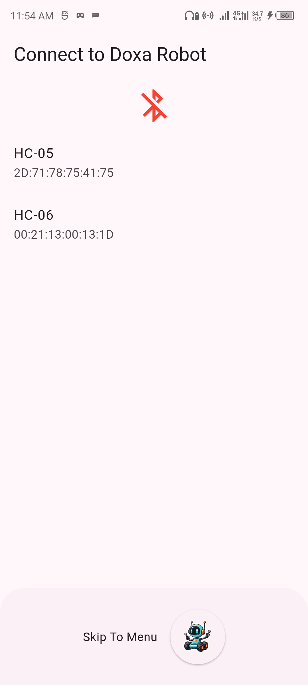
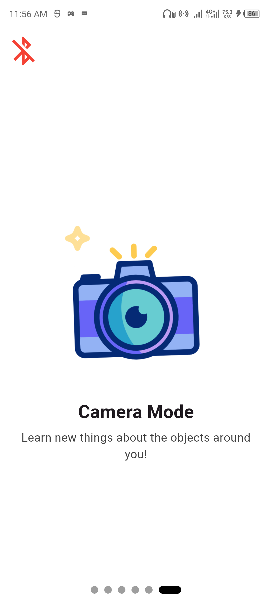
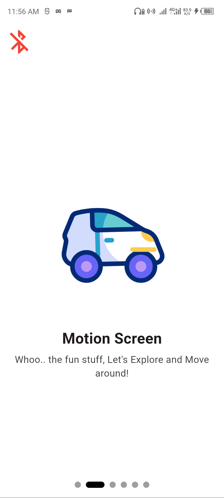
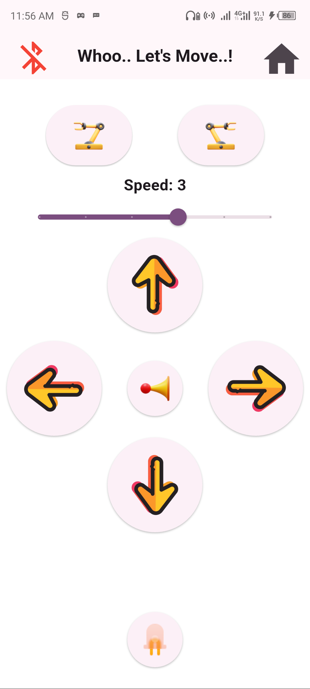

# 🤖 DOXA — Bluetooth-Powered Educational Robot App

**Doxa** is an inspiring and educational mobile app that connects to a robot via Bluetooth. Built with Flutter, Doxa empowers users—especially students and learners—to interact with a robot for learning, creativity, and hands-on exploration of robotics.

---

## 🖼️ App Screenshots

  
  
  

  
  
  

  

---

## 🎥 Demo Preview

---

## 📦 Download APK

👉 [Download the latest APK]([https://github.com/your-username/doxa/releases/latest](https://drive.google.com/file/d/1PX6C5RUIicSEY1Fo3To7kE2z4_XZaL44/view?usp=sharing))

> 🔐 No login required — just install and start exploring.

---

## 🛠️ Built With

- Flutter & Dart
- Bluetooth connectivity
- Educational robotics logic
- [Add anything else: Firebase, Provider, etc.]

---

## 👤 Author

**Witty Hub**   
wittyhubrobotics@gmail.com

---

Feel free to fork this project or reach out for collaboration!
